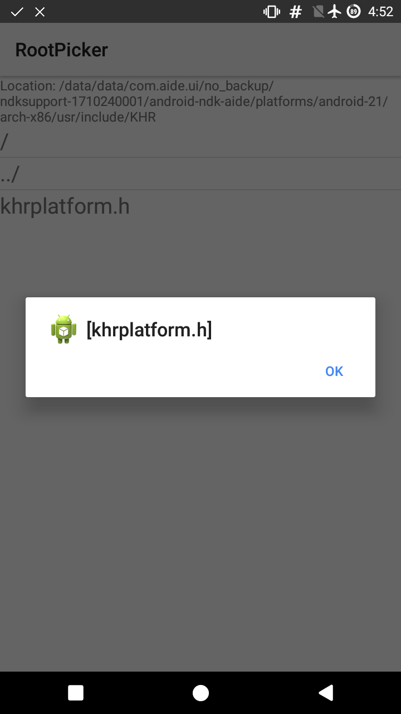

# RootFilePicker
The simplest root file picker for android apps.

# Install

##If you know easier way, please create a pull request.

1. Clone this repository.
1. Copy src/java/com folder to your project src/java/.
1. Copy src/main/res/layout/row.xml and fileselactivity to your res folder.
1. Copy libs/roottools.jar to your libs folder.
1. Copy assets/* to your assets.
1. Add `<activity android:name="com.kyhsgeekcode.fileselectoractivity"/>` to `AndroidManifest.xml`.
1. Add `import your.package.name.R` in the `fileselactivity.java`.